# Plutus Eye

 Is a Global Market prediction web API that aims to improve and automate analysis of the stock market price direction based on available historical data.
 

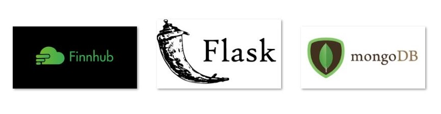

### Development

 Setup Development environment 

1. Create a python 3.x virtual environment

    `$ python3 -m venv env`

2. Activate virtual environment 

    `$ <project-dir>\env\Scripts\activate`
    
3. Install the python modules listed in `requirements.txt`
    * Python Libraries
        * flask==1.1.2
        * flask-jwt-extended==3.25.0
        * flask-pymongo==2.3.0
        * pymongo==3.11.2
        * python-dotenv==0.15.0
        * dnspython==2.0.0
        * pyopenssl==20.0.0

* Environment Variables on `.env` file
    * FLASK_APP=plutus_eye
    * FLASK_ENV=development
    * MONGO_URI=mongodb+srv://`dbuser`:`dbpassword`@`<mongodb-host>`/`<dbname>`?retryWrites=true&w=majority
    * JWT_SECRET_KEY='super-secret'
    * GATEWAY_TOKEN = 'bv1io9f48v6o8DemoX'
    
### Database Setup
See https://cloud.mongodb.com for the instruction

## API Endpoints
https://`<host>`:`<port>`/`<API Endpoints>`

### User Registration and Login End Points
POST /register 201

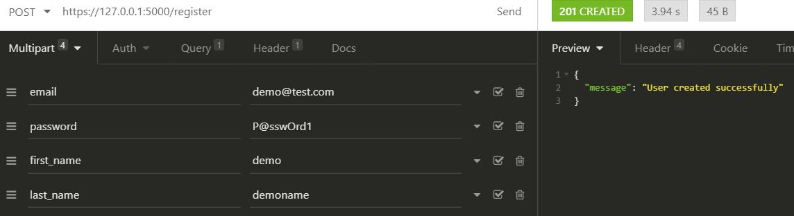

POST /login 200

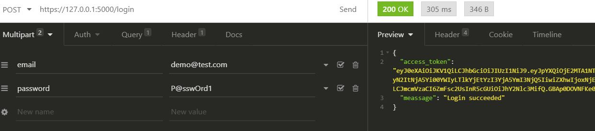

### Global Markets
 
#### Ticker End Points
POST /global/tickers 201

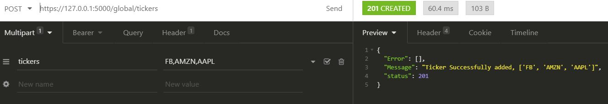

GET /global/tickers 200

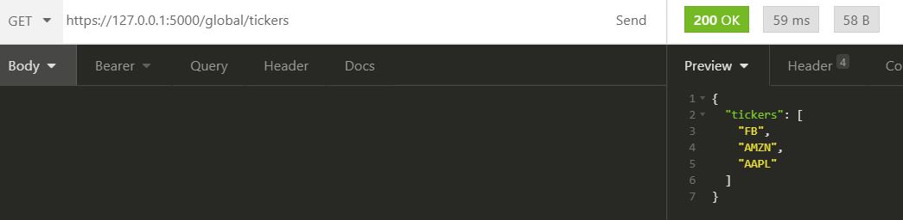

DELETE /global/tickers 200

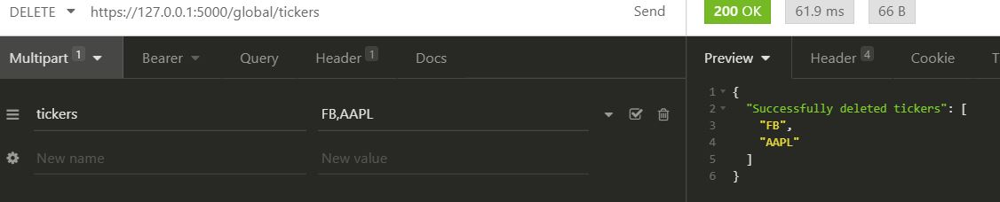

#### Candlestick Patterns End Points

GET /candle/global/<string:ticker> 200

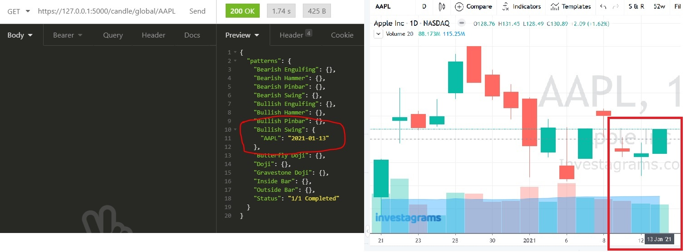

POST /candle/global  201

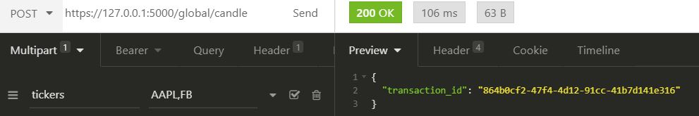

GET /candle/transaction/<string:transaction> 200

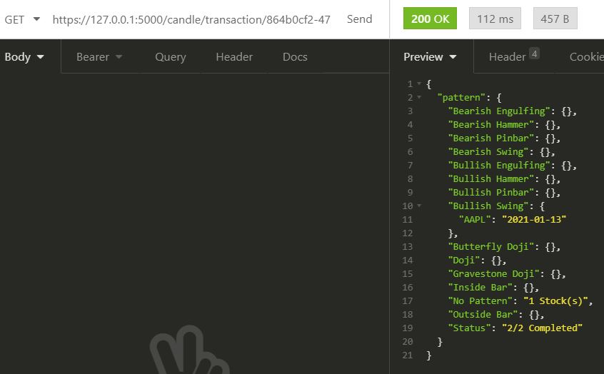

DELETE /candle/transaction/<string:transaction> 200

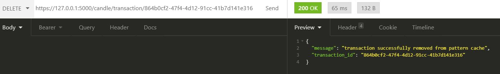

DELETE /candle/transaction/ALL 200

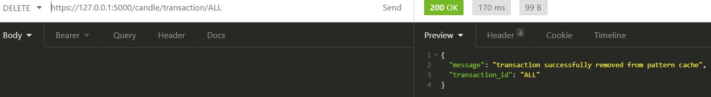

#### High Volume Stock End Point

GET /volume/global/<string:ticker> 200

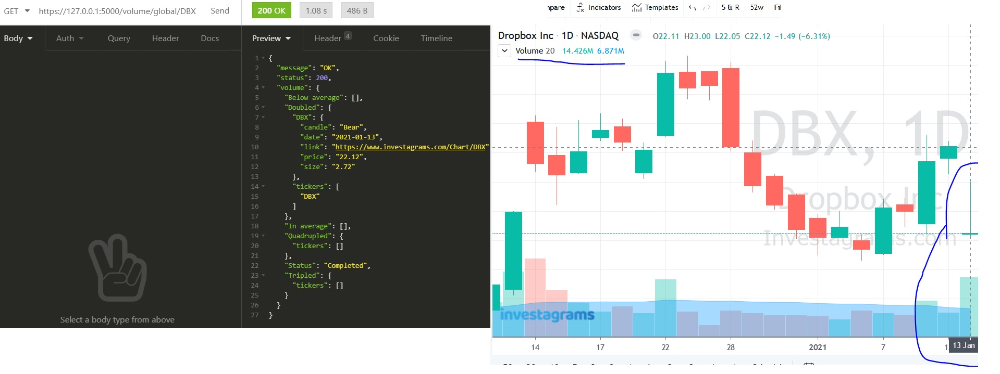

POST /volume/global 201

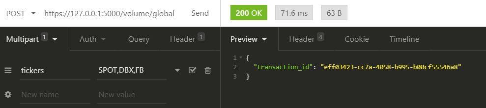

GET /volume/transaction/<string:transaction> 200

DELETE /volume/transaction/<string:transaction> 200

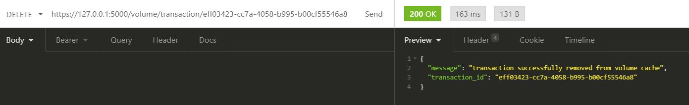

DELETE /volume/transaction/ALL 200

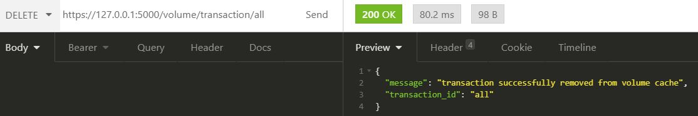

### PSE Market Tickers

POST /candle/pse  201

GET /candle/pse/<string:ticker> 200

GET /candle/transaction/<string:transaction> 200

DELETE /candle/transaction/<string:transaction> 200

POST /pse/tickers 201

GET /pse/tickers 200

GET /pse/tickers/default  200

DELETE /pse/tickers  200

### Volume

POST /volume/global 201

GET /volume/global/<string:ticker> 200

GET /volume/transaction/<string:transaction> 200

DELETE /volume/transaction/<string:transaction> 200

POST /volume/pse 201

GET /volume/pse/<string:ticker> 200

GET /volume/transaction/<string:transaction> 200

DELETE /volume/transaction/<string:transaction> 200

## Execution
1. Generate `cert.pem` and `key.pem` certificates see https://blog.miguelgrinberg.com/post/running-your-flask-application-over-https 

    `openssl req -x509 -newkey rsa:4096 -nodes -out cert.pem -keyout key.pem -days 365`

2. Run flask app with `--cert` and `--key` parameters

    `flask run --cert=plutus_eye\cert.pem --key=plutus_eye\key.pem`

